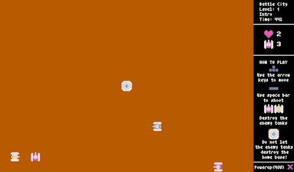
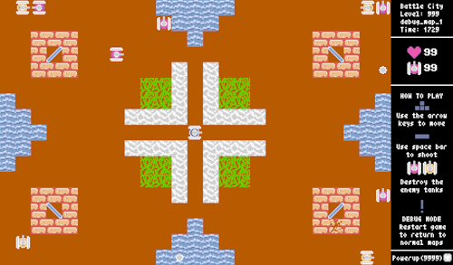

# battle-city
  
A tank battle game based on _"Battle City"_ (Namco, 1985) using [Pyxel](https://github.com/kitao/pyxel).

Made by Mansur Batistil and Gabriel Mislang for CS12 MP1.
This game implements all the specifications from **Phase 1** up to **Phase 3**, with some extra features added.

The game background music is an arrangement of _"American Patrol"_ (Frank White (F.W.) Meacham, 1885). More specifically, it is based on the [stage 1 music](https://www.youtube.com/watch?v=NFHvcxBCeb4) used in the NES port of the game _"Circus Charlie"_ (Konami, 1986)


## Controls

<kbd>Arrow Keys</kbd>: Move tank  
<kbd>Space</kbd>: Shoot bullets  
<kbd>R</kbd>: Respawn tank / Restart game  
<kbd>Enter</kbd>: Next stage  
<kbd>Ctrl+N</kbd>: Restart game at any point  
<kbd>M</kbd>: Mute / Unmute game music  
<kbd>Delete</kbd>: Debug mode


## How to play

### Game Basics
**Destroy all the enemy tanks** in order to advance to the next stage!  
There are elements in the map that can either hinder you or help you out in destroying those tanks.  
Be careful though! **Do not let the enemy tanks destroy your home base!**

### Powerups
If you are able to destroy **_half of the total number of enemy tanks_** quickly enough, you will gain an **extra life!**


## The Stage File

### File Format Specifications
The stage files are stored using the `.json` format.    
It is named `levelXX.json`. Where **XX** is the level number of the stage file.  
If the level number is less than 10, a leading zero must be added. (for example, `level01.json`)  
Stage files are to be placed in `assets/levels/`.


### Stage File Contents
A stage file consists of the following:
- `level` -> `int`  
 The level number of the stage

- `stage_name` -> `str`   
 The name of the stage.

  Can be at most 12 characters long (including spaces)

- `enemy_count` -> `int`   
 Specifies the amount of enemy tanks the stage.

- `powerup_req` -> `int`  
 Specifies the time (in frames) until the powerup can be obtained in that stage.
  
  See [Powerups](#powerups) for more information.

- `tutorial` -> `int`  
 Specifies what tutorial information will be shown in the sidebar.
 
  The default value is `0` if there is no tutorial for that specific stage.

- `map` -> `list[list[int]]`  
 This represents the map for that stage as a grid of cells.  
 Each entity/cell type in the map is represented as an integer from `0-9`.  
 A standard map has a grid size of `25 x 17` cells.

  See [Map Index Values](#map-index-values) for the list of cell/entity types

### Map Index Values

Each integer values in the map correspond to a specific cell/entity type:

| Value | Cell / Entity Type         | Image                                                                            |
| :---: |  :-----------------------: | :------------------------------------------------------------------------------: |
|   0   | Empty Cell                 |                                               |
|   1   | Player Tank Spawn          |                                              |
|   2   | Enemy Tank Spawn           |    |
|   3   | Player Home Base           |                                             |
|   4   | Stone                      |                                                    |
|   5   | Brick                      |             |
|   6   | Mirror (North-East Facing) |                                      |
|   7   | Mirror (South-East Facing) |                                      |
|   8   | Water                      |                                                    |
|   9   | Forest                     |                                                  |

### Stage File Example

```
{
    "level":1,
    "stage_name": "a_map",
    "enemy_count": 10,
    "powerup_req": 1500,
    "tutorial": 0,
    "map": [
        [2,2,2,2,0,0,0,0,0,0,8,8,8,8,8,0,0,0,0,0,0,2,2,2,2],
        [2,2,2,2,0,0,0,0,0,0,0,8,8,8,0,0,0,0,0,0,0,2,2,2,2],
        [2,2,5,5,5,0,0,0,0,0,0,0,8,0,0,0,0,0,0,0,5,5,5,2,2],
        [2,2,5,6,5,0,0,0,0,0,0,0,0,0,0,0,0,0,0,0,5,7,5,2,2],
        [0,0,5,5,5,0,0,0,0,0,0,4,0,4,0,0,0,0,0,0,5,5,5,0,0],
        [0,0,0,0,0,0,0,0,0,9,9,4,0,4,9,9,0,0,0,0,0,0,0,0,0],
        [8,0,0,0,0,0,0,0,0,9,9,4,0,4,9,9,0,0,0,0,0,0,0,0,8],
        [8,8,0,0,0,0,0,0,4,4,4,4,0,4,4,4,4,0,0,0,0,0,0,8,8],
        [8,8,8,0,0,0,0,0,0,0,0,0,1,0,0,0,0,0,0,0,0,0,8,8,8],
        [8,8,0,0,0,0,0,0,4,4,4,4,0,4,4,4,4,0,0,0,0,0,0,8,8],
        [8,0,0,0,0,0,0,0,0,9,9,4,0,4,9,9,0,0,0,0,0,0,0,0,8],
        [0,0,0,0,0,0,0,0,0,9,9,4,0,4,9,9,0,0,0,0,0,0,0,0,0],
        [2,2,5,5,5,0,0,0,0,0,0,4,0,4,0,0,0,0,0,0,5,5,5,0,0],
        [2,2,5,7,5,0,0,0,0,0,0,0,0,0,0,0,0,0,0,0,5,6,5,2,2],
        [2,2,5,5,5,0,0,0,0,0,0,0,8,0,0,0,0,0,0,0,5,5,5,2,2],
        [2,2,2,2,0,0,0,0,0,0,0,8,8,8,0,0,0,0,0,0,0,2,2,2,2],
        [2,2,2,2,0,0,0,0,0,0,8,8,8,8,8,0,0,0,0,0,0,2,2,2,2]
    ]
}
```

## Cheat Code
There is a cheat code which **gives the player an extra life**. In order to activate the cheat code, the **Konami Code must be inputted in-game**.

The input is as follows (on keyboard): <kbd>Up</kbd>,<kbd>Up</kbd>,<kbd>Down</kbd>,<kbd>Down</kbd>,<kbd>Left</kbd>,<kbd>Right</kbd>,<kbd>Left</kbd>,<kbd>Right</kbd>,<kbd>B</kbd>,<kbd>A</kbd>,<kbd>Enter</kbd>,

---

Note: Pyxel does not have a method for detecting if **any** key was pressed. Only if **a specified** key was pressed.  
Because of this, the cheat code input was implemented in such a way that it only activates if the specified keys were pressed **in order** within the timeframe of **5 seconds**. If the input was in the incorrect sequence or there was too much/too little input, the input list will be reset.

If you messed up attempting to do the cheat code, _please wait 5 seconds and try again._

As a result, it can be also be activated by pressing <kbd>KEYPAD ENTER</kbd> 5 times.


## Debugging

  
To access the debug mode (and access the debug maps) for game testing, press <kbd>Delete</kbd> 5 times. Note that **activating the debug mode will permanently keep the game in the debug mode state**.  

Debug mode allows for a set of debug maps to be played specifically made for testing, debug messages toggled in the console and debug controls toggled for close analysis of the game states.

Stage files for debug levels use the same format as normal stage files, however they must be named `debuglevelXX.json`.

Debug maps are stored in `assets/levels/debug_levels`. You may add more debug levels here for specific testing.

Close and reopen the game in order to return to the normal maps.

### Debug Mode Controls

<kbd>T</kbd>: Prints the current state of `map_database` into the console  
<kbd>F1</kbd>: Instantly kill the player  
<kbd>MINUS</kbd>: Go to the previous level  
<kbd>EQUALS</kbd>: Go to the next level  
<kbd>INSERT</kbd>: Use debug mode on regular levels


## Contributions

### Mansur Batistil
- Game Assets / UI
- First implementation for Map_Database System
- Stage File / loading system
- First implementations for Stone, Brick, Mirror, Water, Forest 
- Music / Sound Effects
- HP / Lives
- Powerup / Restart Game
- Cheat Code & Debug Mode
- Documentation

### Gabriel Mislang
- Main input system
- Final implementations for Enemy Tank + Variants, Mirror, Home Base
- Final implementations for Map_Database System
- Tank movement and collision detection system
- Enemy Tank AI
- Player Movement
- Bullet collision system + edge cases
- Debugging program logic


## Demo Video

[Gameplay Demo](https://drive.google.com/file/d/1vMCZBMFLhfkIajVDX65otKoMLW5msomZ/view?usp=sharing)